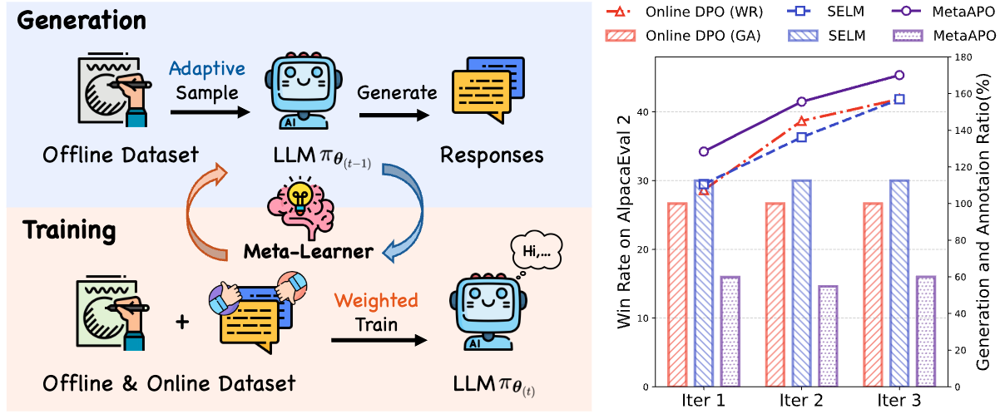

# [ICLR 2026] MetaAPO

[English](README.md) | [中文](README_zh.md)

<div align="center">

**Alignment through Meta-Weighted Online Sampling: Bridging the Gap Between Data Generation and Preference Optimization**  
Junming Yang, Ning Xu, Biao Liu, Shiqi Qiao, Xin Geng

[](https://arxiv.org/abs/2509.23371)
[](https://huggingface.co/collections/jmyang/meta-apo)

</div>

## Overview



Preference optimization is crucial for aligning large language models (LLMs) with human values and intentions, but it often suffers from distribution mismatch between pre-collected offline preference data and the continually evolving policy. **Meta-Weighted Adaptive Preference Optimization (MetaAPO)** introduces a lightweight meta-learner as an “alignment gap estimator” to assess the potential benefit of on-policy sampling relative to offline data. This enables targeted online generation and assigns sample-wise meta-weights in the optimization objective, dynamically balancing the quality and distribution of online and offline data. Experiments on AlpacaEval 2, Arena-Hard, and MT-Bench show consistent improvements while reducing online annotation costs by about 42%.

## Quick Start

### Requirements

- Python 3.10+ (recommended)
- GPU environment with CUDA (recommended)
- Dependencies: `requirements.txt`

### Install

```bash
conda create -n metaapo python=3.10 -y
conda activate metaapo
pip install -r requirements.txt
pip install -e .
```

### Run

Run from the repository root:

```bash
bash scripts/run_metaapo.sh
```

> [!TIP]
> `run_metaapo.sh` is the primary/default training entry.
> You can also run:
> - `bash scripts/run_metaapo_simpo.sh` for the SIMPO variant.
> - `bash scripts/run_metaapo_qwen.sh` for the Qwen 2.5 7B variant.
> - `bash scripts/run_dpo.sh` for the DPO baseline.

> [!NOTE]
> `run_metaapo.sh` uses HuggingFace models and datasets by default (see `*_MODEL_PATH` / `DATASET_PATH` in the script). Replace them with resources you can access, and make sure you are authenticated with HuggingFace if needed.

## Acknowledgements & Citation

This project is developed based on the [OpenRLHF](https://github.com/OpenRLHF/OpenRLHF) framework.

If you find this work helpful, please cite our paper:

```bibtex
@article{yang2025alignment,
  title={Alignment through Meta-Weighted Online Sampling: Bridging the Gap between Data Generation and Preference Optimization},
  author={Yang, Junming and Xu, Ning and Liu, Biao and Qiao, Shiqi and Geng, Xin},
  journal={arXiv preprint arXiv:2509.23371},
  year={2025}
}
```
